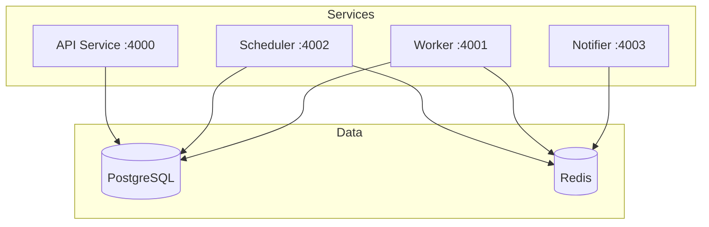

# Architecture Diagrams

This document contains ASCII architecture diagrams for the HyperVerge API Health Monitor System. These can be easily converted to images using tools like [Excalidraw](https://excalidraw.com/), [draw.io](https://draw.io/), or [Mermaid](https://mermaid.live/).

## 1. System Overview Diagram

**Filename:** `system.png`

```
┌─────────────────────────────────────────────────────────────────────────────┐
│                     HyperVerge API Health Monitor System                    │
├─────────────────────────────────────────────────────────────────────────────┤
│                                                                             │
│  ┌─────────────┐                                                           │
│  │   Client    │                                                           │
│  │  (Browser)  │                                                           │
│  └──────┬──────┘                                                           │
│         │ HTTPS                                                            │
│         ▼                                                                  │
│  ┌─────────────┐     ┌─────────────┐     ┌─────────────┐     ┌──────────┐ │
│  │     API     │     │  Scheduler  │     │   Worker    │     │ Notifier │ │
│  │   Service   │     │   Service   │     │  Service    │     │ Service  │ │
│  │  (Express)  │     │  (Cron)     │     │ (BullMQ)    │     │ (BullMQ) │ │
│  │  :4000      │     │  :4002      │     │  :4001      │     │  :4003   │ │
│  └──────┬──────┘     └──────┬──────┘     └──────┬──────┘     └────┬─────┘ │
│         │                   │                   │                  │       │
│         │                   │                   │                  │       │
│         ▼                   ▼                   ▼                  ▼       │
│  ┌─────────────────────────────────────────────────────────────────────┐  │
│  │                            Redis (BullMQ)                           │  │
│  │                          Job Queue & Cache                          │  │
│  │                             :6379                                   │  │
│  └─────────────────────────────────────────────────────────────────────┘  │
│         │                   │                   │                  │       │
│         ▼                   ▼                   ▼                  ▼       │
│  ┌─────────────────────────────────────────────────────────────────────┐  │
│  │                         PostgreSQL Database                         │  │
│  │              Users, Monitors, CheckResults, Incidents               │  │
│  │                             :5432                                   │  │
│  └─────────────────────────────────────────────────────────────────────┘  │
│                                                                             │
└─────────────────────────────────────────────────────────────────────────────┘
```

---

## 2. Data Flow Diagram

**Filename:** `flow.png`

```
┌──────────────────────────────────────────────────────────────────────────┐
│                           Health Check Data Flow                          │
└──────────────────────────────────────────────────────────────────────────┘

  ┌─────────────┐
  │  Scheduler  │
  │   Service   │
  └──────┬──────┘
         │ 1. Query monitors from DB
         ▼
  ┌─────────────┐
  │  PostgreSQL │ ◀───── Monitors table
  └──────┬──────┘
         │ 2. Return monitor list
         ▼
  ┌─────────────┐
  │  Scheduler  │
  └──────┬──────┘
         │ 3. Enqueue check jobs
         ▼
  ┌─────────────┐
  │    Redis    │ ◀───── health-checks queue
  └──────┬──────┘
         │ 4. Dequeue job
         ▼
  ┌─────────────┐
  │   Worker    │
  │   Service   │
  └──────┬──────┘
         │ 5. Execute HTTP check
         ▼
  ┌─────────────┐
  │   Target    │
  │     API     │ ◀───── monitored endpoint
  └──────┬──────┘
         │ 6. Response (UP/DOWN)
         ▼
  ┌─────────────┐
  │   Worker    │
  │   Service   │
  └──────┬──────┘
         │ 7. Store result + detect state change
         ▼
  ┌─────────────┐
  │  PostgreSQL │ ◀───── CheckResults, Incidents
  └──────┬──────┘
         │ 8. If incident, enqueue notification
         ▼
  ┌─────────────┐
  │    Redis    │ ◀───── notifications queue
  └──────┬──────┘
         │ 9. Dequeue notification
         ▼
  ┌─────────────┐
  │  Notifier   │
  │   Service   │
  └──────┬──────┘
         │ 10. Send alert
         ▼
  ┌─────────────────────────────┐
  │   Email / Webhook / Slack   │
  └─────────────────────────────┘
```

---

## 3. AWS Infrastructure Diagram

**Filename:** `aws.png`

```
┌──────────────────────────────────────────────────────────────────────────────┐
│                              AWS Infrastructure                               │
│                              Region: us-east-1                                │
└──────────────────────────────────────────────────────────────────────────────┘

  ┌────────────────────────────────────────────────────────────────────────────┐
  │                                  VPC                                        │
  │                            CIDR: 10.0.0.0/16                               │
  │  ┌──────────────────────────────────────────────────────────────────────┐  │
  │  │                         Public Subnets                               │  │
  │  │  ┌────────────────┐              ┌────────────────┐                  │  │
  │  │  │  us-east-1a    │              │  us-east-1b    │                  │  │
  │  │  │  10.0.1.0/24   │              │  10.0.2.0/24   │                  │  │
  │  │  └───────┬────────┘              └───────┬────────┘                  │  │
  │  │          │                               │                           │  │
  │  │          ▼                               ▼                           │  │
  │  │  ┌───────────────────────────────────────────────┐                   │  │
  │  │  │           Application Load Balancer           │ ◀── HTTPS :443   │  │
  │  │  └───────────────────────────────────────────────┘                   │  │
  │  └──────────────────────────────────────────────────────────────────────┘  │
  │                                    │                                        │
  │                                    ▼                                        │
  │  ┌──────────────────────────────────────────────────────────────────────┐  │
  │  │                        Private Subnets                               │  │
  │  │  ┌────────────────┐              ┌────────────────┐                  │  │
  │  │  │  us-east-1a    │              │  us-east-1b    │                  │  │
  │  │  │  10.0.10.0/24  │              │  10.0.20.0/24  │                  │  │
  │  │  └───────┬────────┘              └───────┬────────┘                  │  │
  │  │          │                               │                           │  │
  │  │          ▼                               ▼                           │  │
  │  │  ┌─────────────────────────────────────────────────────────────────┐ │  │
  │  │  │                    ECS Fargate Cluster                          │ │  │
  │  │  │  ┌─────────┐ ┌───────────┐ ┌──────────┐ ┌──────────┐           │ │  │
  │  │  │  │   API   │ │ Scheduler │ │  Worker  │ │ Notifier │           │ │  │
  │  │  │  │ Service │ │  Service  │ │ Service  │ │ Service  │           │ │  │
  │  │  │  └─────────┘ └───────────┘ └──────────┘ └──────────┘           │ │  │
  │  │  └─────────────────────────────────────────────────────────────────┘ │  │
  │  │          │                               │                           │  │
  │  │          ▼                               ▼                           │  │
  │  │  ┌─────────────────────┐   ┌─────────────────────────────────────┐  │  │
  │  │  │   ElastiCache       │   │          RDS PostgreSQL             │  │  │
  │  │  │   Redis Cluster     │   │        Multi-AZ Deployment          │  │  │
  │  │  │   cache.t3.micro    │   │           db.t3.micro               │  │  │
  │  │  └─────────────────────┘   └─────────────────────────────────────┘  │  │
  │  └──────────────────────────────────────────────────────────────────────┘  │
  │                                                                             │
  │  ┌───────────────────┐  ┌──────────────────┐  ┌───────────────────────┐    │
  │  │    CloudWatch     │  │       ECR        │  │    Secrets Manager    │    │
  │  │  Logs & Metrics   │  │  Container Repo  │  │  Database Creds, JWT  │    │
  │  └───────────────────┘  └──────────────────┘  └───────────────────────┘    │
  └─────────────────────────────────────────────────────────────────────────────┘
```

---

## 4. Service Communication Diagram

**Filename:** `services.png`

```
┌──────────────────────────────────────────────────────────────────────────┐
│                        Service Communication                              │
└──────────────────────────────────────────────────────────────────────────┘

                          ┌───────────────────┐
                          │   External APIs   │
                          │  (Monitored URLs) │
                          └─────────▲─────────┘
                                    │
                          HTTP GET/POST
                                    │
  ┌─────────────┐                   │
  │     Web     │──── REST ────▶┌───┴───────┐
  │   (Next.js) │               │    API    │
  └─────────────┘               │  :4000    │
                                └───┬───────┘
                                    │
                              SQL (Prisma)
                                    │
                                    ▼
  ┌─────────────┐            ┌───────────────┐            ┌─────────────┐
  │  Scheduler  │────────────│   PostgreSQL  │────────────│   Worker    │
  │   :4002     │   SQL      │    :5432      │   SQL      │   :4001     │
  └──────┬──────┘            └───────────────┘            └──────┬──────┘
         │                                                       │
         │ Enqueue Jobs                            State Change? │
         │                                                       │
         ▼                                                       ▼
  ┌───────────────────────────────────────────────────────────────────────┐
  │                              Redis                                     │
  │                             :6379                                      │
  │                                                                        │
  │   ┌─────────────────┐           ┌───────────────────────────────────┐ │
  │   │ health-checks   │           │     notifications queue          │ │
  │   │ queue           │           │     (email, webhook)             │ │
  │   └─────────────────┘           └───────────────────────────────────┘ │
  └───────────────────────────────────────────────────────────────────────┘
                                           │
                                           │ Dequeue
                                           ▼
                                    ┌─────────────┐
                                    │  Notifier   │
                                    │   :4003     │
                                    └──────┬──────┘
                                           │
                              ┌────────────┼────────────┐
                              │            │            │
                              ▼            ▼            ▼
                        ┌─────────┐  ┌─────────┐  ┌─────────┐
                        │  Email  │  │ Webhook │  │  Slack  │
                        │  SMTP   │  │  HTTP   │  │   API   │
                        └─────────┘  └─────────┘  └─────────┘
```

---

## 5. Database Schema Diagram

**Filename:** `database.png`

```
┌──────────────────────────────────────────────────────────────────────────┐
│                           Database Schema                                 │
└──────────────────────────────────────────────────────────────────────────┘

  ┌────────────────────────────────────────────────┐
  │                    Users                        │
  ├────────────────────────────────────────────────┤
  │  id         UUID         PK                    │
  │  email      VARCHAR(255) UNIQUE                │
  │  password   VARCHAR(255)                       │
  │  createdAt  TIMESTAMP                          │
  │  updatedAt  TIMESTAMP                          │
  └────────────────────────────────────────────────┘
                         │
                         │ 1:N
                         ▼
  ┌────────────────────────────────────────────────┐
  │                   Monitors                      │
  ├────────────────────────────────────────────────┤
  │  id          UUID         PK                   │
  │  name        VARCHAR(255)                      │
  │  url         VARCHAR(2048)                     │
  │  method      ENUM (GET, POST, HEAD)            │
  │  interval    INTEGER (seconds)                 │
  │  timeout     INTEGER (ms)                      │
  │  status      ENUM (UP, DOWN, UNKNOWN)          │
  │  userId      UUID         FK → Users.id        │
  │  createdAt   TIMESTAMP                         │
  │  updatedAt   TIMESTAMP                         │
  └────────────────────────────────────────────────┘
           │                              │
           │ 1:N                          │ 1:N
           ▼                              ▼
  ┌─────────────────────────┐   ┌─────────────────────────────┐
  │      CheckResults       │   │         Incidents            │
  ├─────────────────────────┤   ├─────────────────────────────┤
  │  id         UUID    PK  │   │  id          UUID      PK   │
  │  monitorId  UUID    FK  │   │  monitorId   UUID      FK   │
  │  status     ENUM        │   │  status      ENUM           │
  │  statusCode INTEGER     │   │  startedAt   TIMESTAMP      │
  │  latency    INTEGER     │   │  resolvedAt  TIMESTAMP?     │
  │  error      TEXT?       │   │  createdAt   TIMESTAMP      │
  │  checkedAt  TIMESTAMP   │   └─────────────────────────────┘
  └─────────────────────────┘

                    ┌─────────────────────────────────────────────┐
                    │                  Jobs                        │
                    ├─────────────────────────────────────────────┤
                    │  id            UUID         PK              │
                    │  monitorId     UUID         FK              │
                    │  status        ENUM (pending,running,done)  │
                    │  scheduledFor  TIMESTAMP                    │
                    │  completedAt   TIMESTAMP?                   │
                    └─────────────────────────────────────────────┘

                    ┌─────────────────────────────────────────────┐
                    │               Deliveries                     │
                    ├─────────────────────────────────────────────┤
                    │  id          UUID         PK                │
                    │  incidentId  UUID         FK                │
                    │  channel     ENUM (email,webhook,slack)     │
                    │  status      ENUM (pending,sent,failed)     │
                    │  attempts    INTEGER                        │
                    │  sentAt      TIMESTAMP?                     │
                    └─────────────────────────────────────────────┘
```

---

## Generating Images

### Using Excalidraw

1. Go to [excalidraw.com](https://excalidraw.com/)
2. Copy the ASCII diagram
3. Paste and arrange elements visually
4. Export as PNG

### Using draw.io

1. Go to [draw.io](https://app.diagrams.net/)
2. Create a new diagram
3. Use the ASCII as a reference
4. Export as PNG

### Using Mermaid

Mermaid diagrams can be embedded in GitHub README:



### Automation Script

```bash
#!/bin/bash
# Generate diagrams using plantuml or mermaid-cli

# Install mermaid-cli
npm install -g @mermaid-js/mermaid-cli

# Generate PNG from mermaid file
mmdc -i diagrams/system.mmd -o architecture/images/system.png
```
